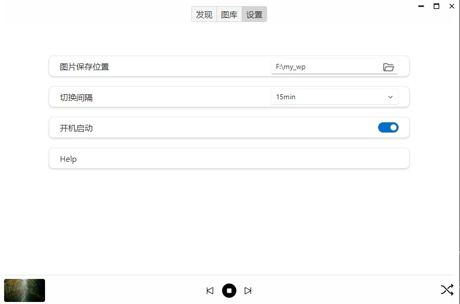

## 功能介绍




### Dev
### Pre Install
- Node.js
- rust: https://tauri.studio/v1/guides/getting-started/prerequisites


```sh
npm install

# js dev
npm start

# app dev
npm run gui
```

### Build
```sh
# 1. build js
npm run build

# 2. build app
npm run tbuild
```
