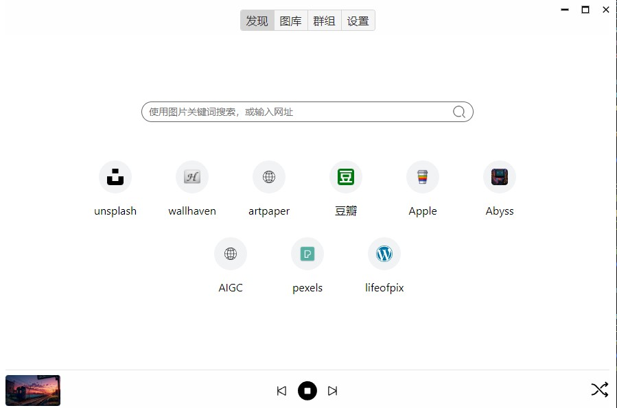

## 功能介绍
基于 Tauri 开发的壁纸小软件（12 MB），*任意网站，一键设置壁纸*

下载: https://github.com/lufengd3/wallpaper-player/releases/tag/0.1.0




### Dev
### Pre Install
- Node.js
- rust: https://tauri.studio/v1/guides/getting-started/prerequisites


```sh
npm install

# js dev
npm start

# app dev
npm run gui
```

### Build
```sh
# 1. build js
npm run build

# 2. build app
npm run tbuild
```
